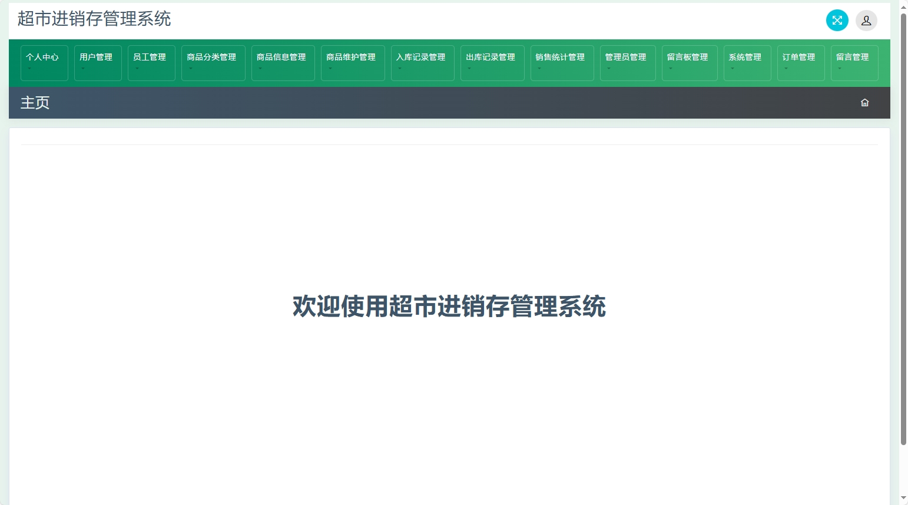
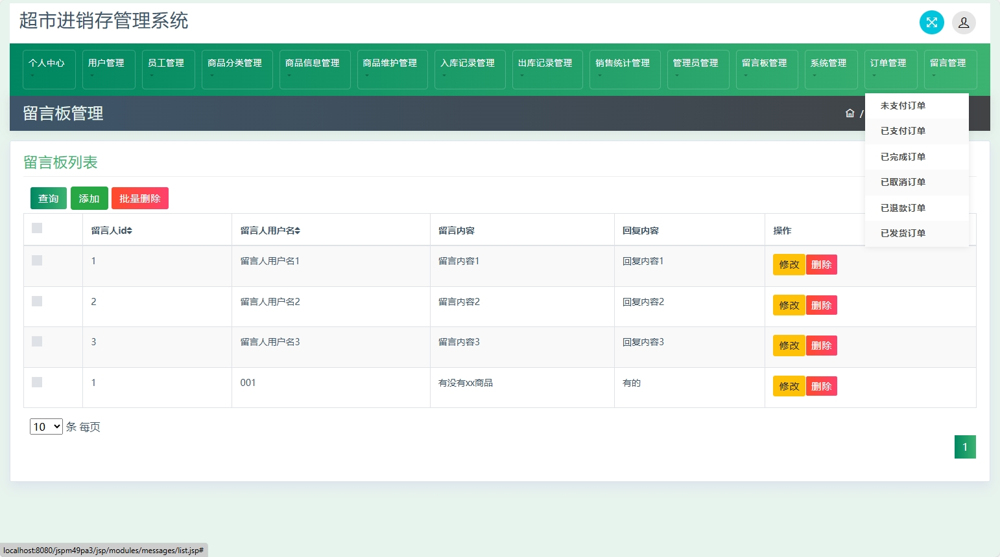

# 超市管理系统(数据库加VX获取☟)
> - 薇：13033494971
#### 介绍
基于SSM的超市管理系统（含进销存出入库）
有BUG可留言加微

#### 软件架构
Java + SSM（Spring + SpringMVC + Mybatis） + Mysql

#### 项目说明（功能模块）

> - 多角色登录
> - 注册
> - 个人中心
> - 用户管理
> - 商品分类管理
> - 商品信息管理
> - 商品维护管理
> - 入库记录
> - 出库记录
> - 销售统计
> - 留言回复功能
> - 新闻咨询
> - 轮播图
> - 订单管理（支付，完成，退款，发货等）等

### 部分功能演示

### 环境需求(可免费提供)
- idea/eclipse、jdk-1.8、maven-3.8.6、mysql

## 有项目修改、安装调试需求 请联系微信
> - 薇：13033494971

## 其他项目定制加微☝☝☝
